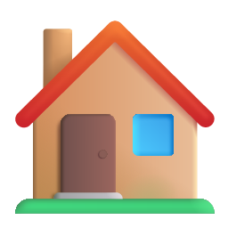
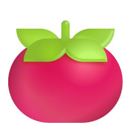
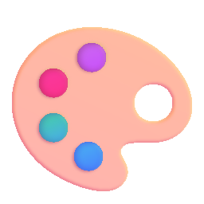

# Frontend — LevelUp Study

Interface web construída com **HTML5, CSS3 e JavaScript puro** (sem frameworks). Todas as páginas são arquivos estáticos que consomem a API REST do backend via `fetch`.

---

## Sumário

- [Páginas](#páginas)
- [Estrutura de arquivos](#estrutura-de-arquivos)
- [Como servir](#como-servir)
- [Autenticação no frontend](#autenticação-no-frontend)
- [Dashboard — seções](#dashboard--seções)
- [Sistema de temas](#sistema-de-temas)
- [Timer Pomodoro](#timer-pomodoro)
- [Comunicação com a API](#comunicação-com-a-api)

---

## Páginas

| Arquivo | Rota | Descrição |
|---|---|---|
| `login.html` | `/login.html` | Tela de login |
| `register.html` | `/register.html` | Tela de cadastro |
| `index.html` | `/index.html` | Dashboard principal (protegido) |

---

## Estrutura de arquivos

```
front_end/
├── index.html      # Dashboard: sidebar + 5 seções de conteúdo
├── login.html      # Formulário de login
└── register.html   # Formulário de cadastro com medidor de força de senha
```

Todo o CSS e JavaScript está inline em cada arquivo — sem dependências externas, sem bundler.

---

## Como servir

Basta abrir os arquivos no navegador. Para evitar problemas de CORS com o backend, sirva a pasta com um servidor local:

```bash
# Python (mais simples)
python -m http.server 5500 --directory front_end

# Node.js (se disponível)
npx serve front_end -l 5500
```

Acesse em `http://localhost:5500/login.html`.

> O backend precisa estar rodando em `http://localhost:5000` para as chamadas funcionarem.

---

## Autenticação no frontend

### login.html

- Valida e-mail e senha antes de enviar
- Exibe spinner durante a requisição
- Mostra mensagem de erro inline (sem `alert()`)
- Redireciona para `index.html` após login bem-sucedido

### register.html

- Valida todos os campos antes de enviar
- **Medidor de força de senha** em tempo real com 5 níveis (cor + texto)
- Verifica se as senhas coincidem em tempo real
- Redireciona para `index.html` após cadastro

### index.html — guard de autenticação

Na inicialização, o dashboard chama `GET /api/auth/me`:

```
Usuário abre index.html
        │
        ▼
   GET /api/auth/me
   ┌─── 200 OK ───────────────────┐
   │  Preenche nome, avatar, XP   │
   │  Carrega status e tarefas    │
   └──────────────────────────────┘
   ┌─── 401 Unauthorized ─────────┐
   │  Redireciona para login.html │
   └──────────────────────────────┘
```

Todas as chamadas à API usam `credentials: "include"` para enviar o cookie de sessão.

---

## Dashboard — seções

O `index.html` é uma Single Page Application simples: uma sidebar fixa com botões que alternam a visibilidade das seções sem recarregar a página.

###  Dashboard

Visão geral com:
- 3 cards de estatísticas (nível, XP total, streak)
- Caixa de sugestão inteligente com botão de atualizar
- Timer Pomodoro compacto com anel SVG

###  Pomodoro

- Timer grande com anel de progresso SVG animado
- Modos de duração: 25/5, 50/10, 15/3, 45/15 minutos
- Indicador de pomodoros concluídos no ciclo atual (4 bolinhas)
- Beep sonoro ao trocar entre foco e pausa (Web Audio API)
- Cards de estatísticas: total de pomodoros, XP acumulado, minutos de foco

###  Tarefas

- Formulário com: título, matéria, prazo e prioridade
- Lista com ordenação automática (não concluídas → alta prioridade → prazo mais próximo)
- Botão de concluir (+30 XP) e botão de excluir
- Badge colorido de prioridade ( Alta ·  Média ·  Baixa)

###  Conquistas

Grid de 11 badges. Badges bloqueados ficam com opacidade reduzida; desbloqueados recebem borda dourada.

| Badge | Condição |
|---|---|
|  Primeiro Pomodoro | 1 pomodoro concluído |
|  Em Chamas | 5 pomodoros |
|  Dedicação | 20 pomodoros |
|  Maratonista | 50 pomodoros |
|  Streak 3 dias | 3 dias seguidos |
|  Semana Perfeita | 7 dias seguidos |
|  Mês de Ouro | 30 dias seguidos |
|  Nível 5 | Alcançar nível 5 |
|  Nível 10 | Alcançar nível 10 |
|  500 XP | Acumular 500 XP |
|  2000 XP | Acumular 2000 XP |

###  Temas

Seletor visual com preview em miniatura de cada tema. A escolha é salva em `localStorage` e aplicada automaticamente na próxima visita.

---

## Sistema de temas

Os temas são implementados com **CSS Custom Properties** no seletor `[data-theme="nome"]` na tag `<html>`. Trocar o tema altera instantaneamente todas as cores da página.

| Atributo `data-theme` | Nome visual |
|---|---|
| `dark` |  Dark (padrão) |
| `ocean` |  Ocean |
| `forest` |  Forest |
| `sunset` |  Sunset |
| `light` |  Light |
| `midnight` |  Midnight |

**Variáveis CSS usadas:**

| Variável | Uso |
|---|---|
| `--bg` | Fundo da página |
| `--surface` | Cards e sidebar |
| `--surface2` | Inputs e itens de lista |
| `--border` | Bordas e separadores |
| `--accent` | Cor de destaque principal |
| `--accent2` | Cor de destaque secundária (textos coloridos) |
| `--accent-glow` | Sombra colorida nos botões primários |
| `--gold` | Badges, XP e destaques |
| `--green` | Sucesso, pausa do timer |
| `--red` | Danger, botão de excluir |
| `--text` / `--text2` | Texto principal e secundário |
| `--muted` | Texto de apoio, labels |

---

## Timer Pomodoro

O timer é compartilhado entre a seção Dashboard (mini) e a seção Pomodoro (full). Ambos exibem o mesmo estado e respondem aos mesmos botões.

**Anel de progresso SVG:**

O anel usa `stroke-dashoffset` para animar o progresso:

```
offset = circunferência × (1 − segundosRestantes / totalSegundos)
```

| Versão | Raio | Circunferência |
|---|---|---|
| Mini (dashboard) | 64px | 402.1px |
| Full (pomodoro) | 96px | 603.2px |

**Beep sonoro** ao fim de cada fase usa a **Web Audio API** (sem arquivo de áudio externo):

```javascript
const ctx = new AudioContext();
const osc = ctx.createOscillator();
// frequência 880 Hz ao fim do foco, 440 Hz ao fim da pausa
```

---

## Comunicação com a API

Todas as chamadas passam pela função `apiFetch`, que injeta `credentials: "include"` automaticamente:

```javascript
function apiFetch(url, opts = {}) {
  return fetch(url, { credentials: "include", ...opts });
}
```

Qualquer resposta `401` dispara `redirectLogin()`, que redireciona para `login.html`.

**Constante de base:**

```javascript
const API = "http://localhost:5000/api";
```

Para apontar para outro servidor, basta alterar essa constante em `index.html`, `login.html` e `register.html`.

## Emojis 3D locais

O catálogo inclui os 139 emojis do inventário, associados pelo Unicode exato.
A renderização compartilhada em `emoji-3d.js` atende login, cadastro, painel,
mensagens, jogos e apresentação. As regras dos jogos continuam usando o texto
Unicode; a imagem altera somente a apresentação.

Execute `node scripts/baixar-emojis.mjs` na raiz para validar/baixar os PNGs
e regenerar o catálogo. Distribua `assets/emoji` junto com o frontend.
Consulte [créditos e licença](assets/emoji/CREDITOS.md).

Com o backend em execução, abra `/tests/emoji-3d.html` para executar a verificação
de carregamento dos 139 PNGs, conteúdo dinâmico, fallback, seletores e canvas.
A página também apresenta uma galeria com o nome Unicode de cada imagem.
O material BMC possui uma [versão HTML com os emojis 3D](../docs_desafio/bmc.html);
o arquivo de texto original foi preservado como referência.

Emojis novos de respostas da IA são carregados sob demanda pela API local,
sem enviar a conversa ao fornecedor. O Unicode permanece visível durante a
busca ou em falhas. Consulte [cache, limites e testes](../back_end/EMOJIS.md).
